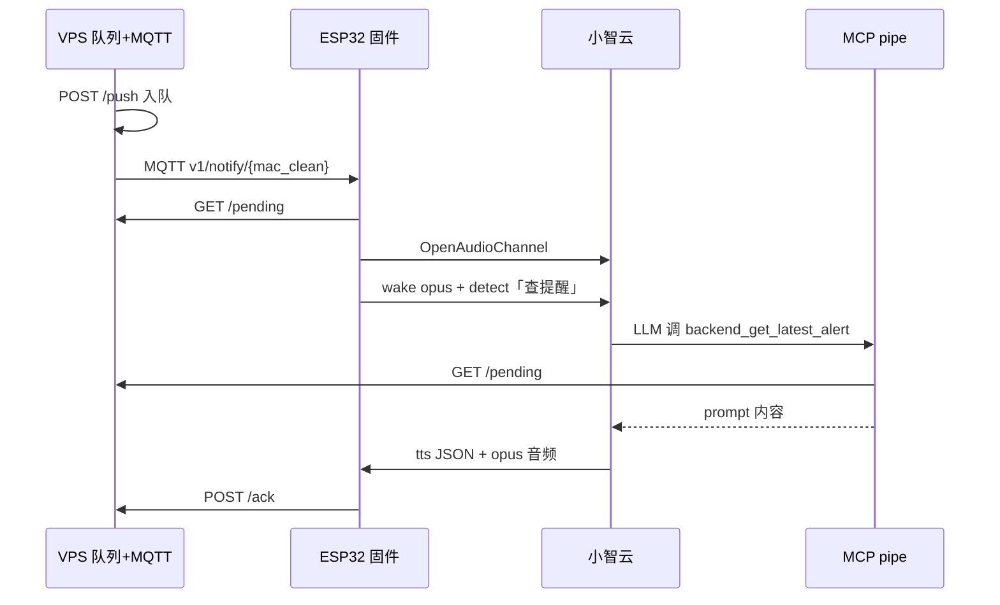

# 会议提醒方案：HTTP 队列 + MQTT 唤醒 + MCP + 官方小智 TTS

## 1. 目标

- **推理侧（VPS/PC）**：维护每设备待提醒队列；`push` 后 MQTT 门铃唤醒固件；可选 MCP 供小智云对话查询。
- **设备侧（ESP32 待机）**：MQTT 或周期 HTTP 轮询发现提醒 → **`mcp_wake` 开官方会话** → 等小智云 **TTS 推流**播报。
- **云端**：官方小智云 MQTT+UDP；**不提供待机 notify**；TTS 必须由云主动下发。

---

## 2. 总体架构



| 通道 | 何时工作 | 作用 |
|------|----------|------|
| **MQTT 唤醒** | push 后 | 秒级触发固件 GET `/pending` |
| **HTTP 轮询** | idle 兜底 | MQTT 丢包或离线恢复 |
| **mcp_wake 投递** | 有提醒且 idle | 短 detect + MCP → **云 TTS** |
| **MCP + mcp_pipe** | 主动提醒 + 用户对话 | 读同一 HTTP 队列 |
| **GeneralTimer** | 本地到点 | 本地闹钟（独立路径） |

---

## 3. REST API 约定

### 3.1 拉取待提醒

```http
GET /v1/devices/{device_id}/reminders/pending
```

`device_id` = 设备 MAC（小写带冒号），与 HTTP 头 `Device-Id` 一致。

**无提醒：**

```json
{ "schema": "v1", "has_reminder": false }
```

**有提醒：**

```json
{
  "schema": "v1",
  "has_reminder": true,
  "id": "meet-20260603-1400",
  "speak": true,
  "delivery_mode": "mcp_wake",
  "wake_text": "查提醒",
  "emotion": "neutral",
  "title": "会议提醒",
  "prompt": "十分钟后有产品评审会，记得进会议室。",
  "expires_at": 1748937600
}
```

| 字段 | 说明 |
|------|------|
| `id` | 全局唯一；固件去重 + ack |
| `speak` | `false` → `alert_only`（仅 UI+振动） |
| `delivery_mode` | 默认 **`mcp_wake`**；见 §4 |
| `wake_text` | `mcp_wake` 时固件发给云的短 detect，默认「查提醒」 |
| `prompt` | **最终播报内容**（自然口语），由 MCP 读队列后交云 TTS；**不是**固件直接上传的 detect 文本 |
| `emotion` | TTS 开始前小球表情 |

完整契约：[server-normalization-plan-v2.md](server-normalization-plan-v2.md)

### 3.2 确认已播报

```http
POST /v1/devices/{device_id}/reminders/ack
Content-Type: application/json

{ "id": "meet-20260603-1400" }
```

### 3.3 MCP 与 API 共用队列

`tools/mcp-calculator/backend_alert.py` 轮询同一 API；`backend_get_latest_alert` 供小智云 LLM 在 **mcp_wake** 流程中读取队列。

---

## 4. 固件投递模式（`DeliverReminder` / `RunReminderDelivery`）

> ⚠️ **已废弃**：~~`DeliverReminderSpeech(prompt)` 将完整 prompt 作为 `SendWakeWordDetected`~~ —  Initial commit 后已改为下表三种模式。

| 模式 | 固件行为 | 推荐 |
|------|----------|------|
| **`mcp_wake`（默认）** | `OpenAudioChannel` → 发 **wake opus** + `detect("查提醒")` → **idle 等云 TTS** → MCP 读队列 | ✅ 生产默认 |
| `direct_wake` | 将 prompt（≤32 字）作为 detect 发出，**无 MCP** | ⚠️ 长文本易被云拒播，勿默认 |
| `alert_only` | 本地 Alert + 振动，不连云 | 静默类通知 |

### 4.1 关键约束（勿违反）

1. **禁止默认 direct_wake / 长文本 detect**  
   小智云易判定为非真实用户对话 → **无 TTS**。默认必须 `mcp_wake`。

2. **固件不上传队列长 prompt**（mcp_wake 下）  
   只 upload 短 `wake_text` + wake opus（`CONFIG_SEND_WAKE_WORD_DATA=y`）。正文走 MCP → 云 TTS。

3. **无消息不播报**  
   `has_reminder: false` → 完全静默。有消息只播 `prompt` 正文，不播流程。

4. **TTS 必须云推流**  
   固件 `SessionKind::ProactiveReminder` 等待 `tts/start` + 音频包；90s 超时 → `proactive_tts_no_audio`。

### 4.2 ReminderPoller 流程

1. idle + `session=None` → HTTP GET `/pending`
2. `has_reminder: false` → 静默返回
3. `has_reminder: true` → `DeliverReminder(mode, …)` → `RunReminderDelivery`
4. `mcp_wake`：开通道 → detect → 等云 TTS → ack → 回 idle

**跳过投递：** 非 idle、闹钟、User 对话、已有 proactive 进行中。

---

## 5. MCP 服务

```bash
cd tools/inference-api-demo && python server.py
cd tools/mcp-calculator
# .env: MCP_ENDPOINT, INFERENCE_API_BASE, INFERENCE_DEVICE_ID
python mcp_pipe.py backend_alert.py
```

用户唤醒后问「有什么提醒」→ 同样走 MCP 读队列（与主动提醒同源）。

---

## 6. 数据流示例

| 时间 | VPS | 固件 | 小智云+MCP |
|------|-----|------|------------|
| T-10min | push + MQTT | MQTT wake → poll → mcp_wake dispatched | MCP 读队列 → TTS「十分钟后…」 |
| T-9min | ack 收到 | 回 idle | — |
| 用户唤醒 | — | User 会话 | MCP 可补充查询 |

---

## 7. 服务器联调

详见 **[server-integration-checklist.md](server-integration-checklist.md)**（检查清单 + 待办，可直接发给后端）。

---

## 8. 相关文件

| 路径 | 说明 |
|------|------|
| `main/reminder/reminder_poller.cc` | HTTP 轮询、`TriggerPoll()` |
| `main/reminder/reminder_mqtt_wake.cc` | MQTT 订阅唤醒 |
| `main/application.cc` | `DeliverReminder()` / `RunReminderDelivery()` |
| `tools/inference-api-demo/server.py` | 队列 API + MQTT publish |
| `tools/mcp-calculator/backend_alert.py` | MCP 工具 |
| [reminder-mqtt-wake.md](reminder-mqtt-wake.md) | MQTT 部署 |
| [proactive-reminder-official-cloud.md](proactive-reminder-official-cloud.md) | 官方云能力边界 |
