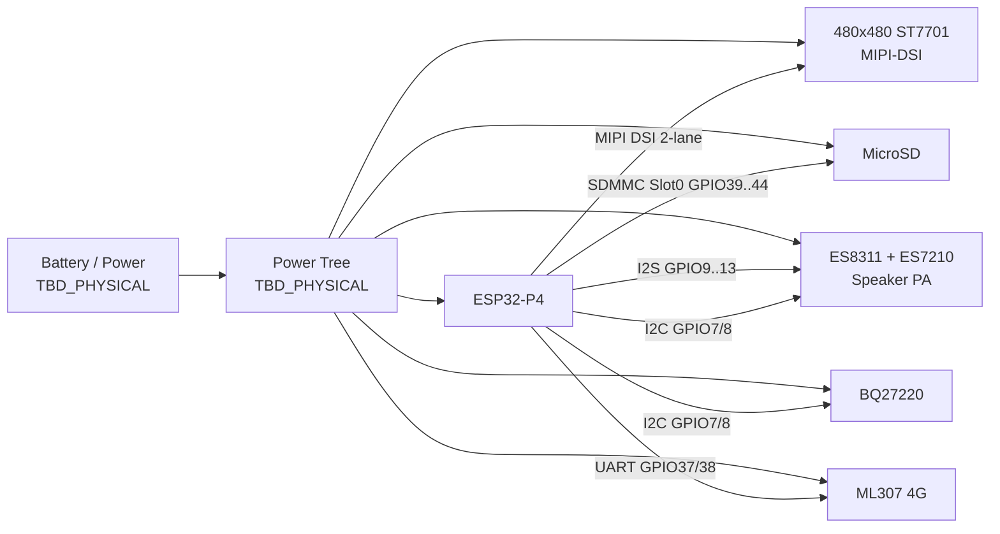
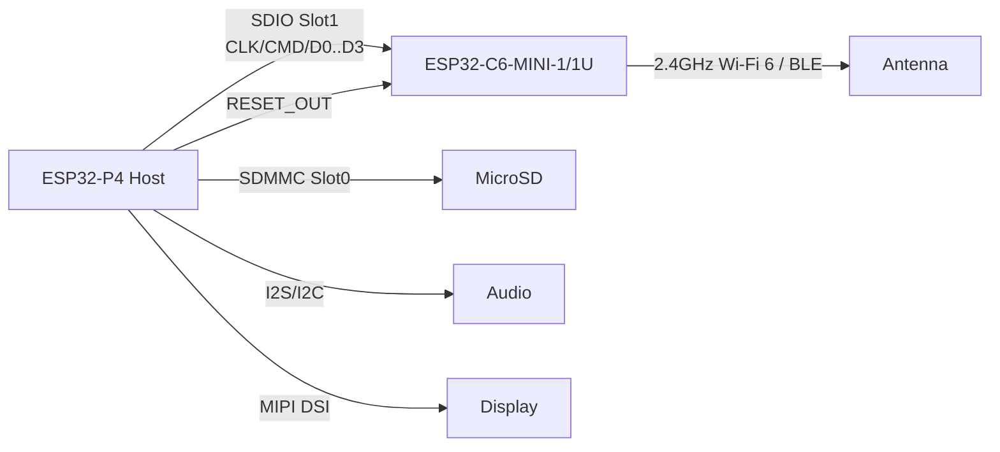

# EP Chat P4 反向硬件设计交付包（Rev A0 / Wi-Fi 变体）

## 1. 交付定位

本目录把当前固件可确认的板级连接、Espressif 官方 ESP32-P4 Function EV Board 参考设计，以及当前工程的音频/显示/SD/网络实践，整理为一版可继续进入原理图设计评审的输入包。

它不是对未知 PCB 的逐网复刻，也不是可直接量产的 Gerber。所有结论按证据等级标记：

- `FIRMWARE_CONFIRMED`：由当前工程的板级配置或驱动调用确认。
- `OFFICIAL_REFERENCE`：来自 Espressif 官方原理图、数据手册或 ESP-Hosted 文档。
- `PROPOSED`：面向 Wi-Fi 版本的工程建议，须经原理图/PCB/样机验证。
- `TBD_PHYSICAL`：固件无法确认，必须向原板原理图、PCB 或实物测量追溯。

## 2. 当前板的可确认系统框图

当前固件确认的主要接口见 `pin-matrix.csv` 和 `interface-netlist.json`。电池输入、充电、电源轨、扬声器功放、LCD 供电时序、ML307 供电控制以及连接器料号仍为 `TBD_PHYSICAL`。

## 3. 推荐 Wi-Fi 架构

### 3.1 首选：ESP32-C6 协处理器 + 4-bit SDIO

ESP32-P4 本身不集成 Wi-Fi/Bluetooth RF。推荐按官方 Function EV Board 的思路增加 `ESP32-C6-MINI-1`；若整机屏幕、金属结构或外壳会遮挡板载天线，则优先评估带外接天线座的 `ESP32-C6-MINI-1U`。

官方 P4 Function EV Board 的 Slot1 映射如下：

| 信号 | ESP32-P4 | ESP32-C6 | 证据 |
|---|---:|---:|---|
| SDIO_CLK | GPIO18 | GPIO19 | OFFICIAL_REFERENCE |
| SDIO_CMD | GPIO19 | GPIO18 | OFFICIAL_REFERENCE |
| SDIO_D0 | GPIO14 | GPIO20 | OFFICIAL_REFERENCE |
| SDIO_D1 | GPIO15 | GPIO21 | OFFICIAL_REFERENCE |
| SDIO_D2 | GPIO16 | GPIO22 | OFFICIAL_REFERENCE |
| SDIO_D3 | GPIO17 | GPIO23 | OFFICIAL_REFERENCE |
| C6_RESET | GPIO54 | EN/RST | OFFICIAL_REFERENCE |

当前固件已把 MicroSD 固定在 Slot0 GPIO39–44，因此从 P4 外设资源角度，Slot1 Wi-Fi 与 SD 卡可以并存。当前板级配置也未使用 GPIO14–19/54；但这只证明“软件没有占用”，不证明现有 PCB 已将这些引脚布出，也不证明与启动绑带、测试点或隐蔽器件无冲突。

### 3.2 不建议直接把 ML307 原位替成 C6

当前固件只显示 P4 与 ML307 通过 UART GPIO37/38 通信。4-bit SDIO Wi-Fi 至少需要 CLK、CMD、D0–D3 和复位，共 7 根关键控制线。因此，除非原 PCB 预留了这些走线，C6 不能靠替换 ML307 模块或只复用 UART 两根线实现官方 ESP-Hosted 路径。

可以把 UART Wi-Fi/AT 模组作为早期网络概念验证，但不建议作为目标架构：它偏离工程已有的 UDP Opus、MQTT、TLS、会话恢复和高吞吐数据路径，后续的软件适配与性能债通常高于增加一版 SDIO PCB。

## 4. 建议的原理图分册

硬件工程师应按下列 sheet 组织原理图，避免把未知网络凭空补齐：

1. `00_Block_Notes`：版本、证据等级、DNP 变体、关键约束和未决事项。
2. `01_Power_Battery`：输入/电池/充电/系统电源树、电量计、各域使能与测点。
3. `02_ESP32_P4_Core`：P4、Flash/PSRAM、晶振、启动绑带、下载调试、复位。
4. `03_Audio`：ES8311、ES7210、麦克风、扬声器功放与模拟地回流。
5. `04_Display_Touch`：MIPI DSI、LCD reset/backlight、触摸接口与供电时序。
6. `05_SD_Storage`：SDMMC Slot0、卡座、ESD、上拉和走线约束。
7. `06_Network_Option`：ML307 与 C6 作为互斥装配变体，不默认同时上件。
8. `07_Expansion_Test`：I2C/中断/电源扩展、调试口、量产测试点。

### 4.1 Wi-Fi sheet 最小电气内容

- `ESP32-C6-MINI-1-N4` 或 `ESP32-C6-MINI-1U-N4`。
- 独立、可测量的 3.3 V 供电域。官方模块要求 3.0–3.6 V，外部电源能力至少 0.5 A；本设计建议按 0.6–0.8 A 余量选稳压器，最终由整机负载瞬态实测定型。
- 电源入口至少 10 µF，并在模块附近布置高频去耦；具体组合以模块最新参考设计为准。
- SDIO CMD 与 DAT0–DAT3 必须上拉，官方建议 51 kΩ。即使先跑 1-bit，也保留 DAT2/DAT3 上拉，避免误入 SPI 模式。
- CLK/CMD/D0–D3 预留串联阻值焊位（默认 0 Ω，SI 调试可换 22/33 Ω），靠近驱动端摆放；最终值由示波器/眼图决定。
- `C6_EN` 需上拉和受控复位；把 P4 GPIO54 作为 host reset 输出，同时保留手动复位/测试点。
- 预留 C6 首次下载接口：3V3 sense、GND、U0TXD、U0RXD、EN、BOOT(GPIO9)。量产后可由 P4 host OTA 更新 C6，但首样和救砖仍需要物理接口。
- 模块天线放在板边并按官方 keepout；若无法保证机壳内净空，选 MINI-1U + 合规外接天线。
- SDIO 只走 PCB，不把飞线当 EVT 验收路径；四层板、完整参考地、短且相对等长。样机可从低频开始，再逐级升到目标频率。

## 5. 电源与共存设计原则

- 不把未知的 ML307 电源轨直接等同为 C6 的 3.3 V。先反查原板稳压器输出、电流能力、上电时序和纹波。
- 音频播放、LCD 背光、SD 写入和 C6 Wi-Fi 发射可能形成同一时刻的电源/总线峰值。电源树需用分域、去耦、使能时序和测点把这些峰值变得可观测。
- P4 基础供电、PSRAM/Flash、LCD/背光、扬声器功放、SD、C6 都需单独预算；`power-budget.csv` 不伪造未知实测数值。
- 首版 Wi-Fi 板建议 ML307 与 C6 二选一装配，避免双网络、双天线和双峰值电源同时扩大验证空间。
- 新设计不要照抄现有 P4 v1.0 约束。选当前可采购且经过评估的 ESP32-P4 新修订版，并逐项核对相应硬件设计指南和勘误；软件仍保留资源预算和降级机制，不能假设新硅片消除了全部问题。

## 6. 软件适配实践路径

### Phase A：板前验证

1. 保留当前 `ep-chat-p4-ml307` 作为功能基线，不直接改名覆盖。
2. 新建独立 Wi-Fi board variant，网络基类改走 `WifiBoard`；音频、MIPI DSI、SD、电量计配置从当前板复制后逐项核对。
3. 在组件依赖中启用官方 `esp_hosted` 与 `esp_wifi_remote`；如工程存在 `esp-extconn`，按官方说明移除冲突依赖。
4. 先使用官方 P4 Function EV Board 或 P4+C6 评估组合跑通 Wi-Fi、MQTT 和 UDP Opus，证明协议层不依赖 ML307，再冻结自研板接口。
5. C6 固件第一次用串口写入；host OTA 只在链路和回滚验证完成后启用。

### Phase B：首板 bring-up

1. 不装大负载，先检查 3.3 V、EN、时钟和下载口。
2. SDIO 从 1-bit/低时钟 bring-up，再到 4-bit 20 MHz，最后根据 SI 和业务吞吐决定是否提高；不把 50 MHz 当默认验收值。
3. 分别验证 MicroSD 和 Wi-Fi，再验证两者并发；并发时关注 SD 错误、Wi-Fi 重传、音频欠载和 P4 看门狗。
4. 从 `WiFi connected → MQTT control → UDP 上行 Opus → 下行长 TTS → 会话退出 → 第二轮唤醒` 逐层闭环。
5. C6 异常应可由 P4 单独复位并恢复，不能把 P4 整机复位当正常恢复机制。

### Phase C：产品化

1. 做整机封装下的天线效率、吞吐、弱信号、热态和多信道测试。
2. 把 Wi-Fi/C6 版本、host 固件版本、C6 slave 固件版本、板修订写入诊断信息。
3. 建立 P4 与 C6 双固件的兼容矩阵、签名/回滚策略和出厂恢复通道。
4. 用 `wifi-bringup-atdd.md` 的验收意图做 EVT/DVT 门，不以“能连热点”代替语音终端验收。

## 7. 量产前必须关闭的未决项

- 原 EP Chat P4 板的完整原理图、PCB 层叠和 BOM 未在当前工程内找到。
- GPIO14–19/54 在实板上的可达性、绑带冲突、测试点和走线长度未知。
- 电池、充电、电源树、ML307 供电轨、LCD/背光和扬声器功放的峰值电流未知。
- C6 天线与 480×480 屏、排线、电池、扬声器磁体和外壳的真实空间关系未知。
- USB、JTAG、下载口和量产治具的占用关系未知。
- P4 具体芯片修订、Flash/PSRAM 型号及其对新板原理图的约束需由采购料号和实物确认。

这些项未关闭前，本包只可进入“原理图设计输入/评审”，不可标记为“量产发布”。

## 8. 交付文件

- `interface-netlist.json`：当前接口和 Wi-Fi 提议网表。
- `pin-matrix.csv`：引脚矩阵、冲突检查和证据等级。
- `power-budget.csv`：已知功耗数据、未知项和量测要求。
- `bom-delta-wifi.csv`：从 ML307 变体切到 C6 Wi-Fi 变体的 BOM 增删建议。
- `wifi-bringup-atdd.md`：板前、EVT 和系统级验收门。

## 9. 主要依据

- 当前工程板级配置：`main/boards/ep-chat-p4-ml307/config.h`
- 当前板初始化：`main/boards/ep-chat-p4-ml307/epchat_ml307_board.cc`
- Espressif ESP32-P4 Function EV Board 用户指南及官方原理图：<https://docs.espressif.com/projects/esp-dev-kits/en/latest/esp32p4/esp32-p4-function-ev-board/index.html>
- 官方原理图：<https://dl.espressif.com/dl/schematics/esp32-p4-function-ev-board-schematics_v1.52.pdf>
- ESP-Hosted SDIO 设计指南：<https://github.com/espressif/esp-hosted-mcu/blob/main/docs/sdio.md>
- ESP-Hosted P4 Host 入门：<https://github.com/espressif/esp-hosted-mcu/blob/main/docs/esp32_p4_function_ev_board.md>
- ESP32-C6-MINI-1/1U 数据手册：<https://documentation.espressif.com/esp32-c6-mini-1_mini-1u_datasheet_en.html>
- ESP32-P4 硬件设计指南：<https://docs.espressif.com/projects/esp-hardware-design-guidelines/en/latest/esp32p4/index.html>

