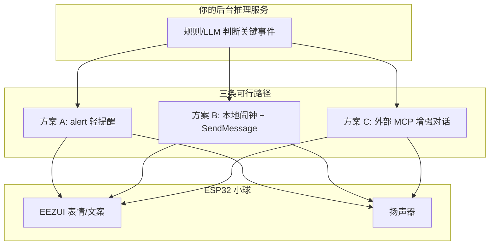
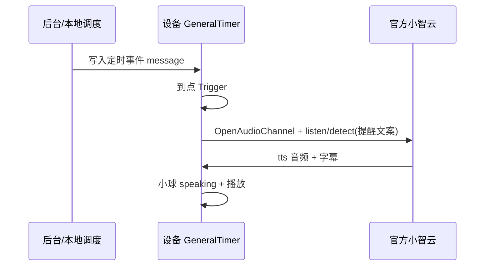

# 官方小智云：后台主动提醒方案

> 本文档替代已回退的 `notify` / `notify_ack` 私有协议方案。  
> **完整实现（固件轮询 + MCP + 会议提醒）见 [architecture-reminder-poll-mcp.md](./architecture-reminder-poll-mcp.md)。**

---

## 1. 官方云能力边界（必读）

根据 [78/xiaozhi-esp32](https://github.com/78/xiaozhi-esp32) 公开协议与社区 issue：

| 能力 | 官方云 | 说明 |
|------|--------|------|
| 待机时云端主动 TTS 播报 | ❌ | 无 `notify`；待机时 WebSocket 通常未连接 |
| 云端下发 `alert` | ✅（协议支持） | UI + 表情 + 振动短音，**无完整 TTS** |
| 会话内 `tts` 播报 | ✅ | 需先建立音频通道（用户唤醒或设备主动开通道） |
| 设备 MCP `notifications/*` 上报 | ❌ | [#1015](https://github.com/78/xiaozhi-esp32/issues/1015)、[#1859](https://github.com/78/xiaozhi-esp32/issues/1859) |
| 外部 MCP 工具（如 [mcp-calculator](https://github.com/78/mcp-calculator)） | ✅ | 对话中 LLM 调工具，**不能**替代待机推送 |

**结论：** 在**不改官方云端**的前提下，「完全静默待机 → 云端直接推语音」做不到；只能组合 **alert + 本地定时/闹钟 + 伪唤醒对话**。

---

## 2. 推荐方案总览



| 方案 | 语音播报 | 需改官方云 | 实现难度 | 推荐场景 |
|------|----------|------------|----------|----------|
| **A. alert** | 仅短提示音 | 需云端能发 alert（待确认） | 低 | 电量低、简单文字提醒 |
| **B. 本地定时 + SendMessage** | ✅ 完整 TTS | 否 | 中 | 定时提醒、本地已算好的文案 |
| **C. 外部 MCP** | ✅ 在对话中 | 否（配 MCP 接入） | 中 | 用户已唤醒后的「查后台结果」 |

---

## 3. 方案 A：官方 `alert`（轻提醒）

### 协议格式（设备已支持）

云端在 **MQTT 会话已建立** 时下发（与 [websocket.md](./websocket.md) 一致）：

```json
{
  "session_id": "xxx",
  "type": "alert",
  "status": "提醒",
  "message": "心率偏高，请注意休息",
  "emotion": "concerned"
}
```

### 设备行为

固件 `Application::OnIncomingJson` 会调用 `Alert()`：

- 更新状态栏、小球表情、`system` 聊天文案
- 播放 `OGG_VIBRATION` 短音

### 限制

1. **不能**依赖待机 WebSocket；MQTT 模式下需设备已 `Start()` 且 broker 能推到设备（官方是否推送 alert 需实测或问官方）。
2. **没有** TTS 长语音，只有振动提示音。

### 后台对接建议

你的推理服务 → 调用**官方开放平台/内部 API**（若有）→ 向设备发 `alert`。若无开放 API，此方案只能作为「协议预留」，实际可能不可用。

---

## 4. 方案 B：本地定时器 + `SendMessage`（本地闹钟，非 HTTP 轮询提醒）

> **注意**：本节描述 `GeneralTimer` / 闹钟路径，与 **HTTP/MQTT 主动提醒的 `mcp_wake` 流程不同**。  
> 轮询提醒请用 [architecture-reminder-poll-mcp.md](architecture-reminder-poll-mcp.md) 与 [server-integration-checklist.md](server-integration-checklist.md)。

工程在 `CONFIG_USE_ALARM` 下已有路径：`GeneralTimer` → `Application::SendMessage()` → 开通道 → `SendWakeWordDetected(提醒文案)` → 官方云 TTS。

### 流程



### 后台如何把「推理结果」交给设备

**方式 1 — 纯本地（不经过你的云）：**

在固件或 NVS/SD 卡里配置 `GeneralTimer::TimerEventAdd(..., message)`，到点自动 `SendMessage`。

**方式 2 — 后台下发提醒文案（需自建桥接）：**

官方云**不能**直接写设备 NVS。可选：

1. 用户下次唤醒时，通过 **MCP 工具** `self.timer.set_reminder`（需你在固件注册工具）写入 `GeneralTimer`；
2. 或通过 **配网/OTA 自定义配置** 下发下一条提醒时间（改动较大）；
3. 或手机 App / 局域网 HTTP 调设备（需额外开发 HTTP API）。

### 固件侧建议新增 MCP 工具（可选实现）

在 `epchat_ml307_board.cc` 的 `RegisterMcpTools()` 中增加：

```text
self.reminder.schedule
  - 参数: trigger_time (unix), message (string)
  - 行为: GeneralTimer::TimerEventAdd(...)
```

这样用户说「帮我设个提醒」或云端 LLM 在**已有对话**里调用工具，可把后台推理结果落到本地定时器。

### 注意

- `SendMessage` 会把 `message` 当**唤醒词/用户意图**发给 LLM，回复内容可能带解释，不保证一字不差播报你写的 `message`。
- 设备需在 **idle** 且网络正常；会短暂开 MQTT+UDP 通道，有功耗。

---

## 5. 方案 C：外部 MCP 服务（对话内查后台）

参考 [78/mcp-calculator](https://github.com/78/mcp-calculator)：在**小智控制台 / 官方 MCP 接入**里挂载你的 MCP Server，提供例如：

| 工具名 | 作用 |
|--------|------|
| `backend.get_latest_alert` | 返回后台最新一条关键信息 JSON |
| `backend.ack_alert` | 确认已读 |

用户唤醒后说：「有什么要提醒我的吗？」→ LLM 调 MCP → 读后台 → 再组织语言 → 官方 TTS 播报。

### 优点

- **完全兼容**官方云，无需私有 `notify`；
- 播报质量由 LLM 控制。

### 缺点

- **不能**在用户未唤醒时主动开口；
- 依赖用户发起对话或唤醒词。

### MCP 服务最小示例（Python）

见仓库内 `tools/mcp-backend-demo/`（`server.py` + `README.md`）。

---

## 6. 方案对比与选型

| 需求 | 推荐 |
|------|------|
| 仅屏幕 + 振动，可接受无语音 | 先试 **方案 A alert**（确认官方是否下发） |
| 定时吃药、休息提醒，文案固定 | **方案 B** 本地 `GeneralTimer` |
| 复杂推理结果，用户主动问 | **方案 C** 外部 MCP |
| 必须待机自动长语音播报 | **仅自建小智服务端** 或等官方能力，不在本文范围 |

---

## 7. 实施步骤（建议顺序）

1. **确认协议**：`menuconfig` 使用 MQTT（OTA 含 mqtt 配置），烧录当前固件（已回退 notify）。
2. **验证 alert**：若官方控制台/文档支持推送，抓 MQTT 日志看是否收到 `type: alert`。
3. **启用闹钟**：`CONFIG_USE_ALARM=y`，用 `GeneralTimer` 设 1 分钟后的测试 message，听是否 TTS。
4. **部署 MCP demo**：按 `tools/mcp-backend-demo/README.md` 接入 calculator 同款方式，对话中测 `get_latest_alert`。
5. **（可选）** 固件增加 `self.reminder.schedule` MCP 工具，把后台结果写入本地定时。

---

## 8. 与已回退代码的关系

以下文件**已恢复**为不含 `notify` 的版本：

- `main/protocols/protocol.{h,cc}`
- `main/protocols/mqtt_protocol.cc`
- `main/protocols/websocket_protocol.cc`
- `main/application.{h,cc}`
- `docs/mqtt-udp.md`

`eezui_display.cc` 中误输入字符 `·1` 的修复**保留**（与 notify 无关）。

若未来官方支持主动播报，再以官方文档为准重新实现，勿沿用私有 `notify` 字段。
